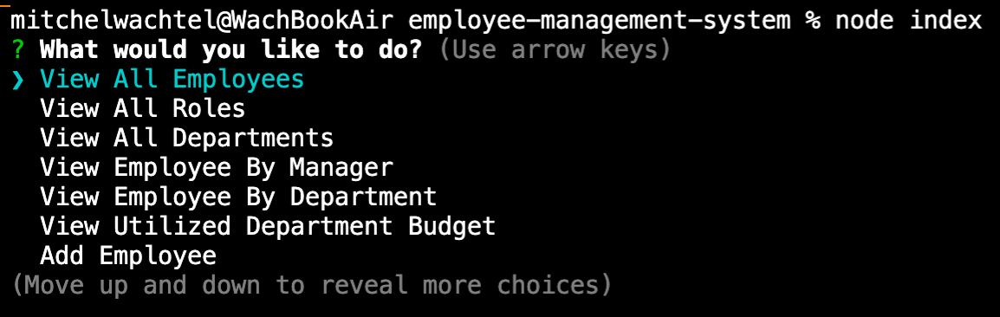
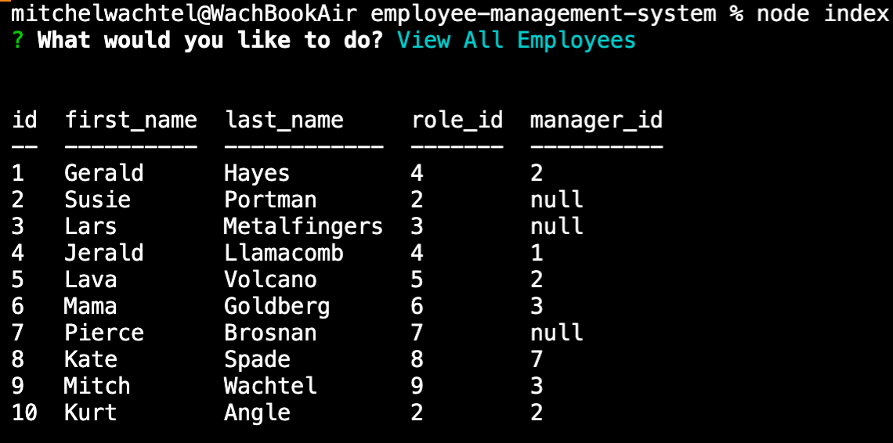
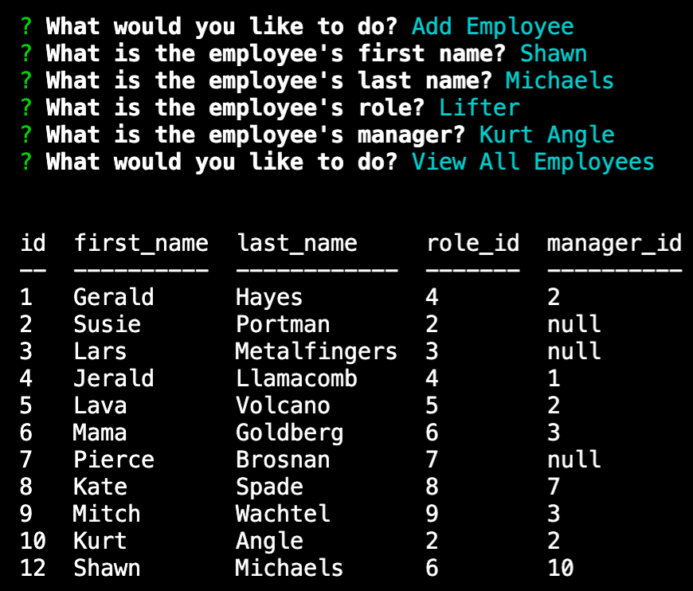

# Employee Management System
## Mitchel Wachtel - mitchel.wachtel@gmail.com

---
### Description
This app is to be used to interact with your company's employee database. You have a table for your employees, departments, and roles. This app will allow you to view, add, update, and delete your employees, roles, and departments. Further, you can use this app to see the total salaries that have been commited for each department.

As a developer, this was the toughest project I've build to-date. I learned a lot about asynchronous functions and mysql queries. I'm proud of the very functional end result, but future development of this project would certainly include better organizing and cleaner writing of the functions used.

---
### Table of contents
* [Installation](#installation)
* [Technology](#technology)
* [Usage](#usage)
* [License](#license)
* [Contributing](#contributing)
* [Tests](#tests)
* [Questions](#questions)
---

### Installation
To install the dependencies necessary to run use the application, the user should run the following command first:

`npm i`

---

### Technology

Technologies used: mySQL, node.js, npm, dependencies: 'inquirer', 'cTable', 'mysql2', and VS Code.

---
### Usage
This terminal application will give you access to your database so you can manage your employees. You must install dependencies for application to be functional along with updating the sequel connection with your personal database information.

Watch *[this video](####)* to see the how using this app works.

---
---
---
### License

Read more about the MIT License *[here](https://opensource.org/licenses/MIT)*.

---
### Contributing
Please contact mitchel.wachtel@gmail.com if you have any desire to contribute to this project.

---
### Tests
No tests are currently set up for this application.

---
### Questions
If you have any questions, please send me an email at mitchel.wachtel@gmail.com and I'll be quick to get back to you! You can also open an issue on GitHub. Find me on GitHub at https://github.com/mitchelwachtel if you are interested in any of my other work.

